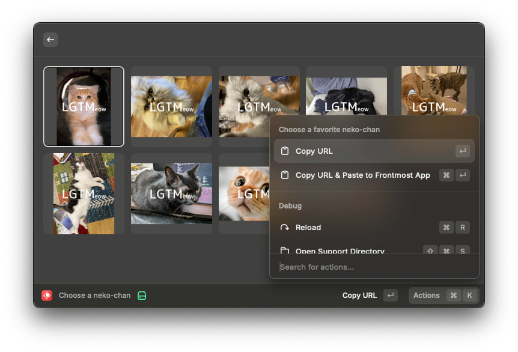

# Raycast Extension for LGTMeow

This is an unofficial Raycast extension that allows you to easily select and paste cat images from LGTMeow (https://lgtmeow.com/) as LGTM images in Markdown format.

LGTMeow is a website that collects cat images that can be used as LGTM images. This extension utilizes the LGTMeow API to display a selection of cat images, allowing you to choose one and obtain its link in Markdown format.

**Note:** This is an unofficial extension and is not planned to be published on the Raycast store.

## Features

- Display a list of cat images from LGTMeow.
- Select an image to copy its Markdown link to your clipboard.
- Easy to use and integrate into your workflow.

## Installation

1. Clone this repository.
2. Navigate to the project directory.
3. Run `npm install` to install the dependencies.

## Usage

1. Run `npm run dev` to start the extension in development mode.
2. Open Raycast and search for "LGTMeow".
3. Select an image from the list to copy its Markdown link.
4. Paste the link where you want to use the LGTM image.
